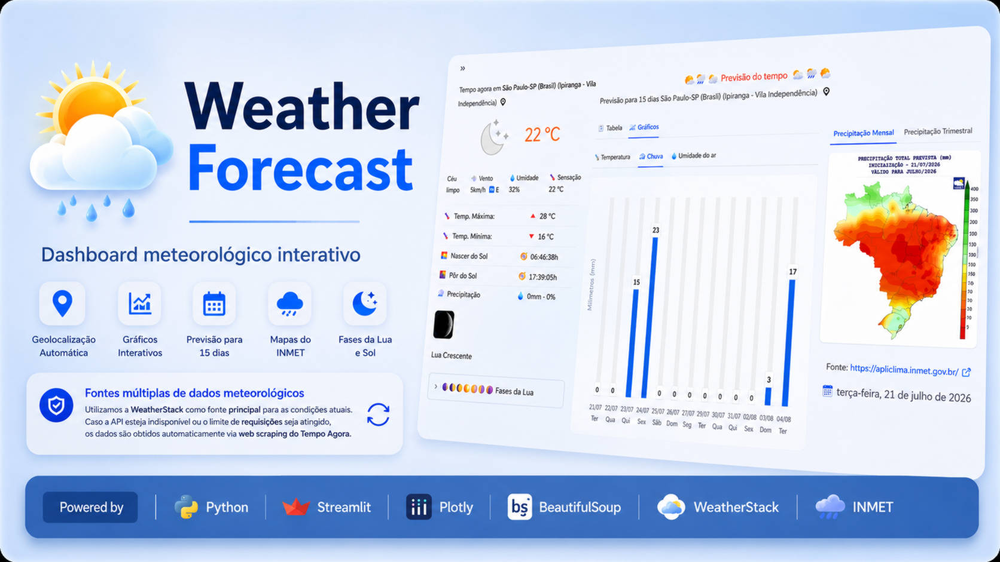

# 🌤️ Weather Forecast
  Dashboard meteorológico desenvolvido com Python, Streamlit, Plotly e Web Scraping.

  https://geof-emersonalves-weather-forecast.streamlit.app/
  
 
 

## Funcionalidades
- 🌎 Geolocalização automática
- 🔍 Busca inteligente de cidades
- 🌤️ Condições climáticas atuais
- 📅 Previsão do tempo para os próximos dias 
- 🌙 Informações astronômicas
- 🌧️ Precipitação
- 🌧️ Consumo da API do Weatherstack 
- 🗺️ Mapas oficiais do INMET (Comsumo da API do INMET )
- 🗺️ Coleta de dados (webscraping) de paginas de clima 
- 📊 Interface interativa desenvolvida em Streamlit
- 📄 Geração automática de relatórios em Excel a partir de um modelo personalizado
- 📈 Gráficos interativos

## Tecnologias
- Python
- Streamlit
- Requests
- Pandas
- OpenPyXL
- BeautifulSoup
- Dotenv
- Geopy - OpenStreetMap(GRATUITO)
- streamlit-geolocation
- Babel
- python-slugify
- cairosvg
- WeatherStack
- INMET
- Pillow


## Ténicas utilizadas
- Web Scraping
- REST API
- Data Visualization
- Caching
- Session State
- Interactive Dashboard
- Responsive Layout
- Image Processing

## Fontes de Dados
- API Weatherstack -- Excelente para dados ao vivo, com velocidadena entrega e cobertura global massiva
- API INMET (Instituto Nacional de Meteorologia) -- obtençãoautomática do mapa de prognóstico de precipitação trimestral

## Diferenciais
✔ Fallback automático entre API e Web Scraping. ✔ Geolocalizaçãoautomática. 
✔ Integração com mapas do INMET. ✔ Previsão de 15 dias. ✔Visualização em gráficos interativos. 
✔ Interface responsiva. ✔Rotatividade automática das chaves da WeatherStack. ✔ Fallbacktransparente para Web Scraping. 
✔ Relatórios completos em Excel. ✔Calendário das fases da Lua

🚀 Novidades da versão
🌙 Calendário das Fases da Lua
A aplicação exibe um calendário com as fases da Lua,apresentando a fase prevista para cada dia juntamente com umarepresentação gráfica correspondente.

📄 Relatório em Excel
O relatório em Excel é gerado automaticamente a partir de ummodelo personalizado, preservando a formatação original e incorporando:
- Condições meteorológicas atuais;
- Previsão para 15 dias;
- Gráficos gerados com Plotly;
- Calendário das fases da Lua;
- Mapas de precipitação do INMET;
- Ícones e imagens meteorológicas.

🔑 Rotatividade automática das chaves da WeatherStack
Para aumentar a disponibilidade da aplicação, foi implementado um mecanismo de alternância automática entre duas chaves da APIWeatherStack.
Caso a chave ativa atinja o limite mensal de consultas, o sistemaalterna automaticamente para outra chave.
Se ambas estiverem indisponíveis, a aplicação utiliza automaticamenteuma estratégia de contingência baseada em Web Scraping, garantindo acontinuidade da obtenção das informações meteorológicas.

⚡ Otimizações implementadas
- Cache das consultas meteorológicas;
- Cache dos ícones meteorológicos;
- Armazenamento local dos ícones baixados;
- Redução de requisições HTTP;
- Tratamento de timeouts e falhas;
- Reutilização automática de imagens;
- Melhor organização da arquitetura da aplicação.

## 📁 Estrutura do Projeto
```
weather-forecast/
│
├── assets/                  # Ícones e imagens da aplicação
│   ├── icons/
│   │   └── weather/   
│   └── images/
│
├── components/              # Componentes da interface Streamlit
│   ├── buttonExcelReport.py
│   ├── city_options.py
│   ├── graficos_previsao.py
│   ├── layout.py
│   ├── local.py
│   ├── nota_rodape.py
│   ├── quadro_clima.py
│   ├── quadro_fases_da_lua.py
│   ├── select_city.py
│   ├── stream_geolocation.py
│   └── tabela_previsao.py
│
├── models/                  # Modelos de dados
│   ├── info_clima.py
│   └── local_vazio.py
│
├── pages/                   # Páginas da aplicação
│   ├── weather_page.py
│   └── sobre_page.py
│
├── services/                # APIs, Web Scraping e regras de negócio
│   ├── busca_cidades.py
│   ├── fase_da_lua.py
│   ├── geolocation.py
│   ├── gerador_de_imagens.py
│   ├── gerador_relat_excel.py
│   ├── get_tokens.py
│   ├── imet_api.py
│   ├── pega_infoclima.py
│   ├── previsao_tempo.py
│   ├── requisicao.py
│   ├── salva_dict.py
│   ├── weather_api.py
│   └── weatherinfo_scraped.py
│
├── state/                   # Gerenciamento de estado da aplicação
│   └── estado_app.py
│
├── templates/
│   └── excel/
│       └── ReportTemplate.xlsx    
├── utils/
│   └── datas.py
│
├── .streamlit/
│   └── config.toml
│
├── app.py                   # Ponto de entrada da aplicação
├── requirements.txt
├── README.md
└── LICENSE
```
## Como executar
```bash
git clone https://github.com/usuario/weather-forecast

cd weather-forecast

pip install -r requirements.txt

streamlit run app.py
```

## Explicacao do codigo regex
```
    (.+?): Captura o nome da cidade (qualquer caractere até encontrar o hífen).
    -: Encontra o hífen que separa a cidade da UF.
    ([A-Z]{2}): Captura exatamente as duas letras maiúsculas da UF.
    \s*: Ignora espaços em branco que possam existir antes dos parênteses.
    \((.+?)\): Captura o texto que está dentro dos parênteses, que representa o país."
```

## Objetivo
```
   Este projeto nasceu como um protótipo para automatizar a geração da aba **PREVISÃO DO TEMPO** 
de um relatório operacional em Excel utilizado em projetos anteriores.

   Ao longo do desenvolvimento, evoluiu para uma aplicação completa de consulta meteorológica, reunindo 
dados de diferentes fontes e oferecendo uma interface interativa construída com **Streamlit**. 
O projeto também serviu como laboratório para o estudo e a aplicação de **consumo de APIs**,  
**Web Scraping**, **manipulação de planilhas Excel** e desenvolvimento de aplicações web em **Python**.
```


